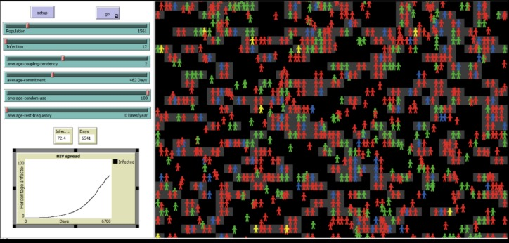

# Spread of HIV/AIDS Through Agent-Based Modeling

This project simulates the spread of HIV/AIDS using an **Agent-Based Model (ABM)** built in **NetLogo**. It aims to analyze how key social and medical behaviors affect the transmission dynamics of HIV across a population.

---

## 🎯 Objective

To understand and visualize how various behavioral and medical factors — such as **condom usage**, **test frequency**, **coupling tendency**, **commitment period**, and **PrEP medication** — influence the spread of HIV. 

The simulation models individuals as autonomous agents and studies their interactions to evaluate disease transmission trends under different scenarios.

---

## 🧰 Tools & Technologies

- **NetLogo** – Agent-Based Modeling environment
- **Mathematical Modeling** – Parameter-driven behavioral simulations
- **PDF Report & Visuals** – Presentation of methodology, findings, and future scope

---

## 📊 Key Variables Modeled

| Variable | Description |
|----------|-------------|
| Population Size | 0–10,000 (tested up to 4,000) |
| Infection Rate | 12%–25% |
| Condom Use | 0%–100% |
| Test Frequency | 0–2 times per year |
| Coupling Tendency | 0–5 new partners/year |
| Commitment Duration | 0–1400 days |
| PrEP Medication | Reduces infection risk by 90% |

---

## 🎨 Simulation Interface

| Agent Color | Status |
|-------------|--------|
| 🟢 Green | HIV Negative |
| 🔵 Blue | On Medication (PrEP) |
| 🟡 Yellow | Infected but Unaware |
| 🔴 Red | HIV Positive |

> ℹ️ *Each agent’s behavior is governed by probabilities and defined parameter values. The simulation reflects disease spread over time and under varied conditions.*

---

## 📸 Screenshots

  
*Example: A simulation run showing agent colors based on infection status*

  
*Legend: Green – Negative, Blue – On PrEP, Yellow – Infected Unaware, Red – HIV Positive*

---

## 📄 Project Report / Slides

For detailed methodology, parameters, results, and future scope:

👉 [**View Full Project Presentation (PDF)**](ABM_HIV_Presentation.pdf)

---

## 🔍 Limitations & Future Scope

**Limitations:**
- Gender-specific behavior is not modeled
- Population is static (no births or deaths)
- No modeling of syringe use or mother-to-child transmission

**Future Enhancements:**
- Introduce gender logic and relationship structures
- Add birth and death rates for realism
- Model vertical transmission and unsafe medical practices
- Optimize simulation performance for higher populations

---

## 👤 Author
Rashika Jain

---

## 🧠 Key Takeaways

This project demonstrates:
- The power of **Agent-Based Modeling** for real-world problems  
- Integration of behavioral science and simulation  
- Potential **policy impact** through scenario testing and variable analysis

---

## 🤝 Contributing

Suggestions or ideas to expand this simulation are welcome!  
Please open an issue or submit a pull request if you'd like to contribute.
